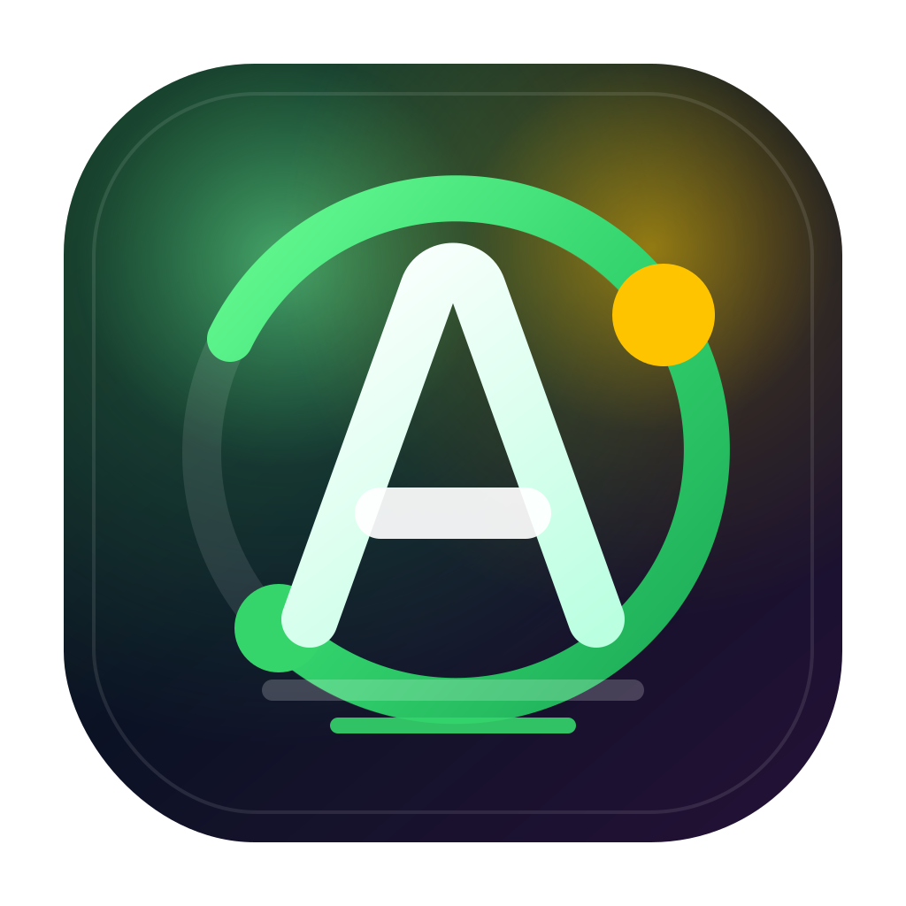
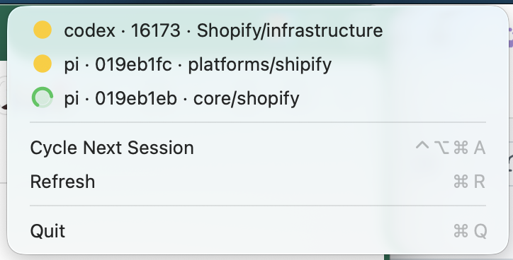

<p align="center">
  
</p>

# AgentBar

macOS menu-bar watcher for Claude Code, Codex CLI, and Pi sessions. It shows which agents are working or waiting, plays a sound when an agent becomes idle, posts a notification, and can jump iTerm2 to the matching tab.

## One-command setup

```bash
git clone https://github.com/maxgiraldo/AgentBar.git
cd AgentBar
./scripts/install.sh
```

The installer:

- builds `AgentBar.app` from `AgentBar.swift`
- installs the app to `/opt/homebrew/Applications/AgentBar.app`
- installs `agent-watch` to `~/.local/bin/agent-watch`
- writes `~/Library/LaunchAgents/com.max.agentbar.plist`
- bootstraps or restarts the LaunchAgent for the current GUI user

## Requirements

- macOS 13+ on Apple Silicon
- Xcode Command Line Tools (`xcode-select --install`)
- Homebrew `jq` (`brew install jq`)
- iTerm2 or Ghostty for focusing terminal sessions

## Usage

- Menu-bar indicator shows total waiting/working state.
- Working sessions use a green spinning ring.
- Idle sessions use a static filled yellow circle.
- `Ctrl+Option+Command+A` cycles through sessions, idle sessions first.
- Clicking a session focuses its iTerm2 or Ghostty tab/window.
- Notifications are sent by the signed app bundle, not `terminal-notifier`.

## Screenshot



## Commands

```bash
make install       # build, install, and reload LaunchAgent
make build-only   # build/install files, do not load LaunchAgent
make status       # print LaunchAgent status and agent list
make doctor       # check local dependencies/signature basics
make uninstall    # unload and remove app/script/plist
```

Direct engine commands:

```bash
~/.local/bin/agent-watch list
~/.local/bin/agent-watch json | jq .
~/.local/bin/agent-watch focus /dev/ttys004
```

Focus is exact for iTerm2 because iTerm2 exposes each session's tty. Ghostty does not expose tty in its AppleScript model, so AgentBar falls back to focusing the Ghostty terminal with the matching working directory.

## Overwriting or removing a legacy install

Running `./scripts/install.sh` overwrites the supported install paths:

- `/opt/homebrew/Applications/AgentBar.app`
- `~/.local/bin/agent-watch`
- `~/Library/LaunchAgents/com.max.agentbar.plist`

If an older AgentBar was installed somewhere else, do a clean reinstall:

```bash
./scripts/uninstall.sh
pkill -x AgentBar 2>/dev/null || true
rm -rf "$HOME/Applications/AgentBar.app"
rm -f "$HOME/Library/LaunchAgents/agentbar.plist"
./scripts/install.sh
```

If you previously installed a global copy in `/Applications`, remove it only if you know it is the old AgentBar:

```bash
sudo rm -rf /Applications/AgentBar.app
```

## Development / contributing

For agents or humans making changes:

1. Edit `AgentBar.swift` for the menu-bar app or `agent-watch` for session detection.
2. Run `make build-only` to compile/sign the app and install the engine without restarting the LaunchAgent.
3. Run `~/.local/bin/agent-watch list` and `~/.local/bin/agent-watch json | jq .` to verify detection.
4. Run `make install` to reload the live LaunchAgent from this repo.
5. Run `make status` and inspect `~/.cache/agent-watch/` if anything looks wrong.

Do not commit generated app bundles, logs, caches, or local build artifacts. The source of truth is the Swift file, the bash engine, scripts, and docs in this repo.

Before opening a PR or pushing:

```bash
make build-only
make status
~/.local/bin/agent-watch json | jq .
git status --short
```

## Paths

- App source: `AgentBar.swift`
- Engine source: `agent-watch`
- Installer: `scripts/install.sh`
- Uninstaller: `scripts/uninstall.sh`
- Installed app: `/opt/homebrew/Applications/AgentBar.app`
- Installed engine: `~/.local/bin/agent-watch`
- LaunchAgent: `~/Library/LaunchAgents/com.max.agentbar.plist`
- Logs: `~/.cache/agent-watch/`

## Troubleshooting

If notifications do not appear, open System Settings -> Notifications -> AgentBar and allow alerts.

If the hotkey does nothing, check for conflicts with other global shortcuts and inspect logs in `~/.cache/agent-watch/`.

If the LaunchAgent is stale after editing, run:

```bash
make install
launchctl kickstart -k gui/$(id -u)/com.max.agentbar
```
